# 🚀 Haseeb • AI-Powered Enterprise Solutions Architect

---

## 🌟 **Transforming Ideas into Intelligent Enterprise Solutions**

I'm a **Generative AI specialist** and **enterprise software architect** who bridges the gap between cutting-edge AI technologies and scalable business solutions. From concept to deployment, I craft intelligent systems that revolutionize how enterprises operate and innovate.

### 🎯 **Current Focus Areas**

```mermaid
graph LR
    A[🤖 Generative AI] --> B[🏢 Enterprise Software]
    B --> C[☁️ Cloud Architecture]
    C --> D[🔒 AI Security]
    D --> A
    
    style A fill:#ff6b6b,stroke:#fff,stroke-width:2px,color:#fff
    style B fill:#4ecdc4,stroke:#fff,stroke-width:2px,color:#fff
    style C fill:#45b7d1,stroke:#fff,stroke-width:2px,color:#fff
    style D fill:#96ceb4,stroke:#fff,stroke-width:2px,color:#fff
```

---

## 🧠 **AI & Machine Learning Expertise**

<table>
<tr>
<td width="50%">

### 🎨 **Generative AI**
- **Large Language Models**: GPT, Claude, Llama
- **Computer Vision**: DALL-E, Midjourney, Stable Diffusion
- **AI Agents**: LangChain, AutoGPT, CrewAI
- **Vector Databases**: Pinecone, Weaviate, ChromaDB
- **Prompt Engineering**: Advanced techniques & optimization

</td>
<td width="50%">

### 🏗️ **MLOps & Deployment**
- **Frameworks**: TensorFlow, PyTorch, Hugging Face
- **Model Serving**: FastAPI, Flask, Docker containers
- **Cloud ML**: AWS SageMaker, Azure ML, GCP Vertex AI
- **Monitoring**: MLflow, Weights & Biases
- **Pipeline Orchestration**: Apache Airflow, Kubeflow

</td>
</tr>
</table>

---

## 🏢 **Enterprise Development Stack**

### **🎯 Backend Excellence**

### **🎨 Frontend Innovation**

### **☁️ Cloud & DevOps**

### **🗄️ Data & Analytics**

---

## 🌟 **Featured AI Projects**

<table>
<tr>
<td align="center" width="33%">

<h3>🧠 Enterprise AI Assistant</h3>

<em>Multi-modal AI system with RAG capabilities for document processing and intelligent automation</em>

</td>
<td align="center" width="33%">

<h3>📊 Predictive Analytics Platform</h3>

<em>Real-time ML pipeline for business intelligence and forecasting using advanced algorithms</em>

</td>
<td align="center" width="33%">

<h3>🔐 AI Security Framework</h3>

<em>Intelligent threat detection system leveraging machine learning for enterprise cybersecurity</em>

</td>
</tr>
</table>

---

## 📈 **GitHub Analytics**

---

## 🎯 **What I'm Building**

> **"Democratizing AI for Enterprise Innovation"**

🔬 **Current Projects:**
- **AI-Powered Code Generation Platform** - Automated enterprise software development
- **Intelligent Document Processing System** - Multi-language NLP with 99.7% accuracy
- **Conversational Business Intelligence** - Natural language to SQL with advanced analytics
- **Autonomous DevOps Agent** - Self-healing infrastructure with predictive scaling

🚀 **Open for Collaboration:**
- Enterprise AI/ML solutions
- Generative AI applications
- Cloud-native architectures
- AI-driven automation platforms

---

## 🌐 **Connect & Collaborate**

---

### 💡 **"Building the Future, One Algorithm at a Time"**

*Let's create intelligent solutions that transform industries and empower innovation.*

---

